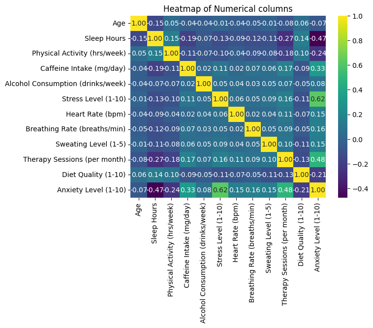
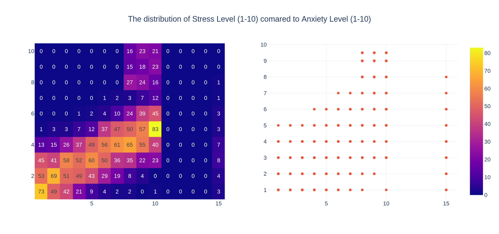
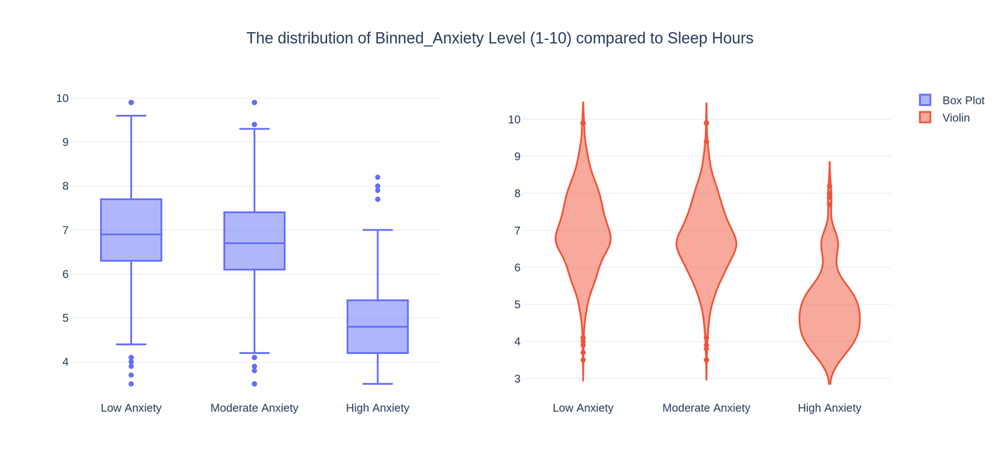

# Social Anxiety: An End-to-End Data Analysis Project

A complete data analysis workflow on a survey of **2,030 respondents** — from raw CSV through
cleaning, feature engineering and exploratory visualisation to formal hypothesis testing and a
written report.

**Question:** what separates an anxious person from a calm one?
**Short answer:** behaviour, not demographics.

| | |
|---|---|
| **Full analysis** | [`Social_Anxiety_Analysis.ipynb`](Social_Anxiety_Analysis.ipynb) — one reproducible notebook, runs top to bottom |
| **Written report** | [`Social_Anxiety_Report.pdf`](Social_Anxiety_Report.pdf) — 27-page illustrated report |
| **Raw data** | [`social_anxiety_dataset.csv`](social_anxiety_dataset.csv) — 2,030 rows, 22 variables |
| **Cleaned data** | [`cleaned_data.csv`](cleaned_data.csv) — output of the preprocessing stage |
| **Working notebooks** | [`Separated Notebooks/`](Separated%20Notebooks) — the original per-stage notebooks |

---

## Team

| | | | |
|---|---|---|---|
| **Amirparsa Rasatalab** | **Faezeh Arshadi** | **Reyhane Chegini** | **Mohammad Yousef Goudarzi** |

---

## Pipeline

| Part | Focus | Techniques |
|---|---|---|
| 1 | Loading & inspection | pandas profiling, duplicate-target check, null audit |
| 2 | Cleaning & feature engineering | IQR winsorization, skew-aware imputation, domain-driven binning, KPI design |
| 3 | Numerical EDA | histograms, Q-Q plots, correlation heatmaps, box/violin, bubble scatter |
| 4 | Categorical EDA | summary dashboards, crosstab heatmaps, treemaps, sunbursts |
| 5 | Statistical inference | t-tests, Mann-Whitney U, chi-square, Pearson/Spearman |
| 6 | Findings | synthesis, limitations, next steps |

---

## Key Findings

**Stress is the strongest correlate of anxiety** — by a wide margin, and nothing else comes close.



The relationship is visible in the raw density: respondents pile up along the diagonal.



**Sleep is the clearest protective factor.** More sleep goes with lower anxiety, and the effect is
visible as a clean downward shift across the three anxiety bands.



### The numbers

| Finding | Statistic | p |
|---|---|---|
| Stress ↔ Anxiety | Spearman rho = **+0.699** | < 0.001 |
| Sleep ↔ Anxiety | Spearman rho = **-0.343** | < 0.001 |
| Physical activity ↔ Stress | Spearman rho = -0.112 | < 0.001 |
| Age ↔ Anxiety | rho = -0.032 | 0.154 — **not significant** |
| Sleep vs 7 h recommendation | mean 6.67 h, t = -12.43 | < 0.001 — significantly lower |
| Heart rate vs 72 bpm norm | mean 92.08 bpm, t = 47.80 | < 0.001 — significantly higher |
| Anxiety band × Therapy group | chi-square = 54.69 | < 0.001 — associated |

- **Anxiety here is a lifestyle profile, not a demographic one.** Age shows no significant
  relationship; gender is independent of both smoking (p = 0.622) and therapy participation
  (p = 0.944).
- **The body corroborates the questionnaire.** Mean heart rate sits 20 bpm above the global norm,
  and 54% show a rapid breathing rate.
- **The therapy result runs backwards.** Anxiety and therapy participation are strongly associated,
  but people seek therapy *because* they are anxious. Cross-sectional data cannot separate treatment
  effect from selection effect, and we do not claim it can.

Full results, effect-size caveats and limitations are in Part 6 of the notebook and Chapters 6–7 of
the report.

---

## Technical Highlights

- **Function-first design** — every cleaning and plotting step is a reusable function, so the
  pipeline can be re-applied to a new dataset in a few lines.
- **Assumption-aware statistics** — `compare()` and `correlation()` run a Shapiro-Wilk normality
  check first, then dispatch to the parametric or non-parametric test automatically. Normality was
  rejected almost universally, so most comparisons use Mann-Whitney U and all correlations use
  Spearman.
- **Tests implemented from first principles** — the t-tests compute the statistic, standard error
  and confidence interval directly rather than calling a black-box function.
- **Missingness preserved as signal** — imputation writes a `*_missing` indicator column for every
  feature instead of discarding the information.
- **Domain logic over blind imputation** — `Therapy History` was 90% missing, but the gaps were
  recoverable from a neighbouring column rather than filled with the mode.

---

## Getting Started

```bash
git clone https://github.com/reyhanechegini/Social_Anxiety_DataAnalysis.git
cd Social_Anxiety_DataAnalysis
pip install pandas numpy scipy matplotlib seaborn plotly
jupyter notebook Social_Anxiety_Analysis.ipynb
```

Both CSVs are included, so the notebook runs top to bottom with no extra setup. Part 2 regenerates
`cleaned_data.csv`; Parts 3–5 read from it.

### Viewing the charts

Many figures use **Plotly**. These are interactive in Jupyter but **do not render on GitHub's static
notebook viewer**. To see them online, paste the notebook URL into
[nbviewer](https://nbviewer.org/), or read the PDF report, which has them all as static images.

---

## Known Data-Quality Notes

Documented openly rather than quietly patched — see Chapter 7 of the report for detail.

- The zero-drinks bin was originally labelled `"None"`, which pandas reads back from CSV as a
  missing value. This silently dropped **95 non-drinkers** from the alcohol analysis. Fixed.
- 30 records fell outside the stress bin edges and were left unlabelled.
- In an earlier run the binary `Target` column collapsed to a single class, making the
  "vs Anxious" comparisons uninformative. The anxiety analysis is therefore built on the continuous
  `Anxiety Level (1-10)` scale, which uses all 2,030 observations.

---

## Tech Stack

Python · pandas · NumPy · SciPy · Matplotlib · Seaborn · Plotly
